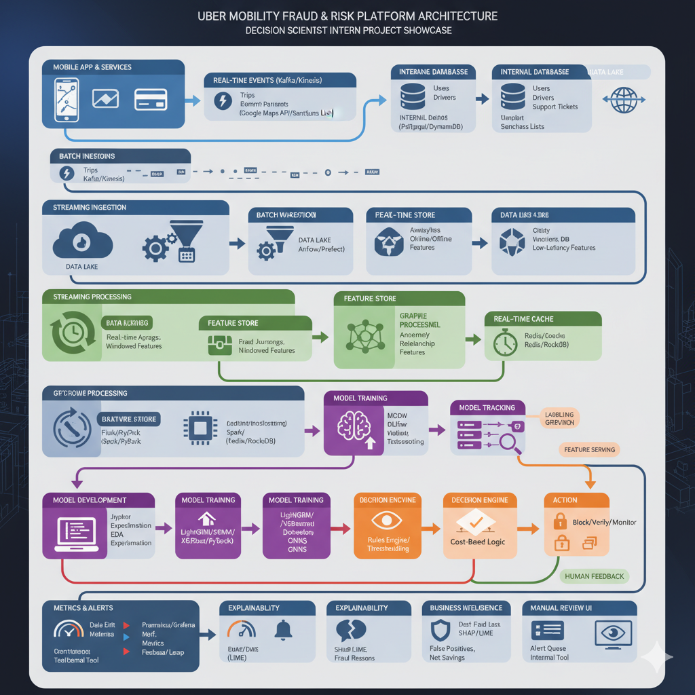

# RideSentry - An End-to-End Mobility Fraud Detection Engine

[](https://www.python.org/downloads/)
[](https://opensource.org/licenses/MIT)

## 1. Project Overview

RideSentry is a comprehensive data science project that simulates a production-level fraud detection system for a modern ride-sharing platform. This project goes beyond simple model training to include a full project lifecycle: synthetic data generation, advanced feature engineering, business-focused model optimization, deep model explainability, and a rigorous A/B testing framework for deployment.

---


## 2. Business Problem & Objective

**Problem:** Payment fraud in the mobility sector leads to direct financial losses, erodes customer trust, and increases operational costs for customer support teams. A reactive approach is insufficient; a proactive, data-driven system is required to identify and mitigate risk in real-time.

**Objective:** To develop a machine learning model that accurately predicts the probability of a transaction being fraudulent, and to create a deployment strategy that maximizes financial savings while protecting the user experience.

---

## 3. Data & Feature Engineering

A synthetic dataset was generated to mirror real-world user and transaction data, with a 2% fraud rate. The core of the predictive power comes from advanced feature engineering.

**Feature Categories:**
* **User History Features:** Capture user tenure and experience (e.g., `seconds_since_signup`, `user_trip_count`). New or inexperienced accounts often correlate with higher risk.
* **Velocity Features:** Monitor the frequency of actions within short time windows (e.g., `user_trips_last_1h`). Spikes in activity are a classic indicator of fraudulent behavior.
* **Relational Features:** Identify suspicious connections between accounts (e.g., `num_users_on_device`). A single device associated with numerous new accounts is a major red flag for fraud rings.

---

## 4. Modeling & Evaluation

### 4.1. Model Selection
A **LightGBM Classifier** was selected for its high performance, speed, and inherent ability to handle imbalanced datasets through parameters like `scale_pos_weight`.

### 4.2. Performance
The model's performance was evaluated using the **Average Precision-Recall (APR) Score**, which is a robust metric for imbalanced classification tasks.
* **Result:** The model achieved an **APR Score of 0.59**, significantly outperforming a random baseline (which would be ~0.02), indicating a strong ability to distinguish fraudulent activity.

### 4.3. Business Impact Analysis
To make the model's output actionable, a cost-benefit analysis was performed to find the optimal prediction threshold.
* **Assumed Costs:**
    * Cost of a False Positive (blocking a good user): **$10**
    * Cost of a False Negative (missing fraud): **$150**
* **Result:** The analysis identified the optimal probability threshold that minimizes total financial cost, providing a clear, data-driven strategy for taking action on model predictions.

---

## 5. Model Explainability (XAI) with SHAP

Understanding *why* the model makes its decisions is critical for trust and debugging. **SHAP (SHapley Additive exPlanations)** was used to interpret the model.

**Key Insights:**
1.  **`fare`:** High fare values were the single most powerful predictor of fraud.
2.  **`user_trip_count`:** Very low trip counts (i.e., new users) were strongly associated with higher fraud risk.
3.  **`seconds_since_signup`:** Similarly, accounts created very recently were flagged as higher risk.
4.  **`user_trips_last_1h`:** A sudden burst of activity was a clear indicator of potential fraud.

---

## 6. Deployment & A/B Testing Framework

A model is only valuable when deployed. A rigorous A/B testing plan was designed to validate its real-world impact.

* **Hypothesis:** The RideSentry model will produce a statistically significant increase in Net Financial Savings.
* **Primary Metric:** Net Financial Savings `(Fraud Prevented) - (Cost of False Positives)`.
* **Guardrail Metrics:** Trip Completion Rate, Customer Support Contact Rate, New User Retention.
* **Decision Criteria:** Roll out the model if the primary metric improves significantly (p-value < 0.05) without harming guardrail metrics.

---

## 7. Tech Stack

* **Data Analysis & ML:** Python, Pandas, NumPy, Scikit-learn, LightGBM, SHAP
* **Visualization:** Matplotlib, Seaborn
* **Development Environment:** Jupyter Notebook
* **Version Control:** Git & GitHub

---

## 8. How to Run

1.  **Clone the repository:**
    ```bash
    git clone [https://github.com/gouri-rabgotra21/RideSentry-Fraud-Detection.git](https://github.com/gouri-rabgotra21/RideSentry-Fraud-Detection.git)
    cd RideSentry-Fraud-Detection
    ```
2.  **Install dependencies:** (A `requirements.txt` file should be created)
    ```bash
    pip install pandas numpy scikit-learn lightgbm shap matplotlib seaborn jupyter
    ```
3.  **Launch Jupyter Notebook:**
    ```bash
    jupyter notebook
    ```
4.  Open and run the main notebook file.
